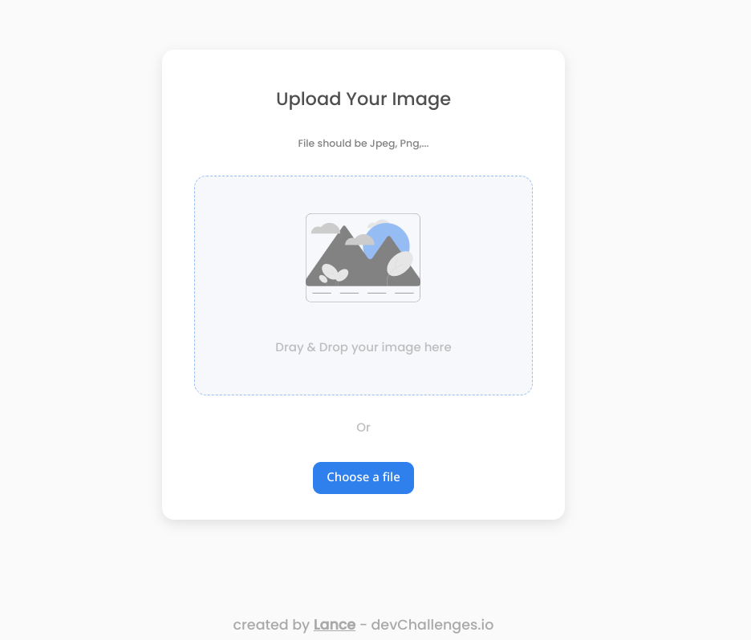

<h1 align="center">Image Uploader</h1>

<div align="center">
   Solution for a challenge from  <a href="http://devchallenges.io" target="_blank">Devchallenges.io</a>.
</div>

<div align="center">
  <h3>
    <a href="https://my-devchallenge-image-uploader.netlify.app">
      Demo
    </a>
    <span> | </span>
    <a href="https://my-devchallenge-image-uploader.netlify.app">
      Solution
    </a>
    <span> | </span>
    <a href="https://devchallenges.io/challenges/O2iGT9yBd6xZBrOcVirx">
      Challenge
    </a>
  </h3>
</div>

<!-- TABLE OF CONTENTS -->

## Table of Contents

- [Overview](#overview)
  - [Built With](#built-with)
- [Features](#features)
- [How to use](#how-to-use)
- [Contact](#contact)
- [Acknowledgements](#acknowledgements)

<!-- OVERVIEW -->

## Overview



To view the demo of this project, visit [my-devchallenge-image-uploader](https://my-devchallenge-image-uploader.netlify.app).
Building this app was a bit of a back and forth initially, as I first tried to build with javascript, html and css only but I realized I could use svelte to make using components and the javascript interactivity with the dom elements a bit easier so I opted for [vite](https://vitejs.dev) and built the initial upload form.

Before continuing, I realized that I will need possibly a form and api route to upload the file so it will be better to run it in a server environment where I can also use an api. Since I was using svelte, I decided to use [sveltekit](https://kit.svelte.dev/).

I found most of the UI building easier with the figma design file and also tailwind css. It was definitely exciting and engaging to get the various fonts and sizes correct in tailwind. I extended tailwind config to add a bit more details like colors from the design, animation for the uploading state and box shadow.

Drag and drop was also a web API I had not used before so it was quite new experience to learn how to do it using [MDN Docs](https://developer.mozilla.org/en-US/docs/Web/API/HTML_Drag_and_Drop_API).

I also used [gitpod](https://gitpod.io) the whole time to build the complete product. I did struggle with not being able to test the upload on gitpod due to a different domain being assigned to the app (gitpod makes available a public domain you can visit to view launched project) other than localhost. It was an issue around the ORIGIN being different so I found the form not working but it did work on the hosting platform I used, [netlify](https:netlify.com/).

### Built With

- [Tailwind](https://tailwindcss.com)
- [Svelte](https://svelte.dev)
- [Sveltekit](https://kit.svelte.dev)

## Features

This application/site was created as a submission to a [DevChallenges](https://devchallenges.io/challenges) challenge. The [challenge](https://devchallenges.io/challenges/O2iGT9yBd6xZBrOcVirx) was to build an application to complete the given user stories.

- User should be able to upload a file.
- User should see a progress monitor whilst file is being uploaded.
- User should be able to see finally uploaded file with a url they can copy.
- Solution should be hosted publicly on github
- Deploy solution and share

## Prerequisites

Since images are uplaoded to cloudinary, in other to view the image, you will need to create a [cloudinary account](https://cloudinary.com/users/login) if you don't have one, copy the _.env.example_ as _.env_ and add the cloudinary credentials required from your cloudinary dashboard.

```bash
cp .env.example .env

# Copy your cloudinary credentials into the .env file

```

## How To Use

To clone and run this application, you'll need [Git](https://git-scm.com) and [Node.js](https://nodejs.org/en/download/) (which comes with [npm](http://npmjs.com)) installed on your computer. From your command line:

```bash
# Clone this repository
$ git clone https://github.com/discoverlance-com/image-uploader

# Install dependencies
$ pnpm install

# Run the app
$ pnpm dev
```

## Acknowledgements

- [Steps to replicate a design with only HTML and CSS](https://devchallenges-blogs.web.app/how-to-replicate-design/)
- [Node.js](https://nodejs.org/)
- [Marked - a markdown parser](https://github.com/chjj/marked)
- [Cloudinary - an image hosting service](https://cloudinary.com/)
- [Drag and drop example](https://jsbin.com/hiqasek/edit?html,js,output)

## Contact

- Website [discoverlance.com](https://discoverlance.com)
- GitHub [@discoverlance-com](https://github.com/discoverlance-com)
- Twitter [@Discoverlance](https://twitter.com/Discoverlance)
